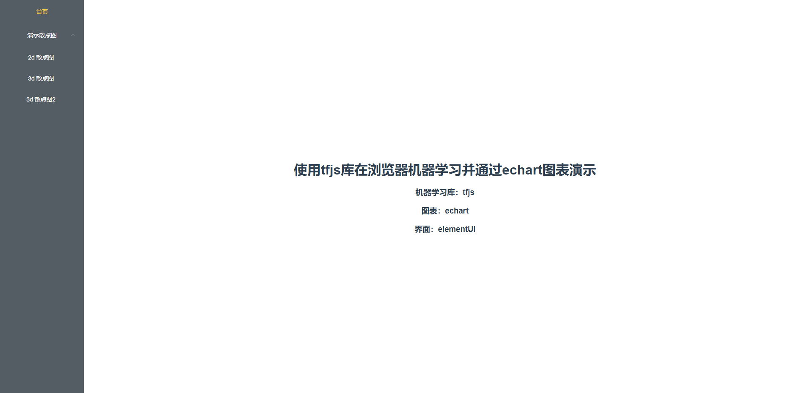
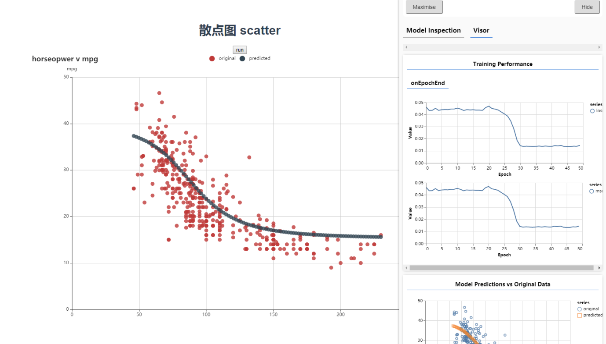
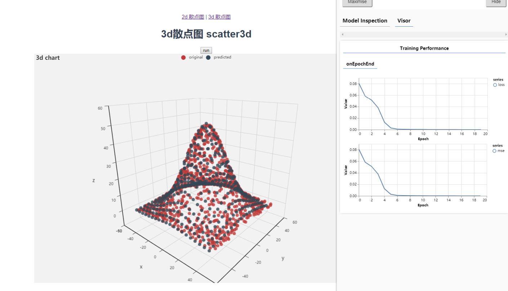
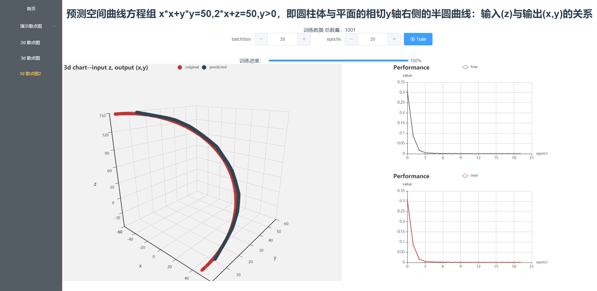

# tfjs-echarts-vue



[线上地址](http://czzonet.com:3000/index.html)

在 vue 中使用 echarts 图表展示机器学习的例子。tfjs 是 tensorflow 的 js 实现，使得可以用浏览器进行机器学习。  
感觉非常好用，或者说简直不要太棒，完全符合自己已有技术和发展需求。所以赶紧参考官方实例实践了一遍，预测了 2d 数据，并拿 echarts 散点图重新可视化了数据。  
对应官方示例见最下面的参考链接。

## 扩展

1. 新增加三维拟合，从演示可以看到对于正态分布的测试数据，已经完全拟合。和 2d 的主要改变是增加输入权重单位为 2，激活函数使用 relu。  
   最终目的是多输入输出的拟合，但是似乎由于维度过高无法演示。

2. 新增加两个输出的模拟，可见在选取唯一坐标对(x,y)的正解的空间曲线下，能够根据 z 值，预测(x,y)值进行拟合。

3. 总结就是输入输出的变量维度的多少，只影响输入输出的形状，原理是一样的。

## 更新

- [x] 20200101: 升级界面，交互
- [x] 20200101: typescript 重构【1/3】
- [x] 20200113: 升级图表组件化，代码逻辑更清晰分明
- [x] 20200118: 精简代码，typescript 重构【3/3】

## 演示

二维数据拟合--一对一输入输出



三维数据拟合--多输入



三维数据拟合 2--多输出



## 使用

```sh
yarn
yarn serve
```

点击`Train`按钮开始训练模型，观察损失，最后输出预测结果

## 起步构建

如果你想从头走一遍

```sh
vue create echarts-vue
cd echarts-vue
yarn add echarts
yarn add @tensorflow/tfjs
yarn add @tensorflow/tfjs-vis
```

然后参照官方教程，进行编程即可。

## References

1. [Making predictions from 2d data &nbsp;|&nbsp; TensorFlow.js &nbsp;|&nbsp; TensorFlow](https://www.tensorflow.org/js/tutorials/training/linear_regression)
2. [TensorFlow.js — Making Predictions from 2D Data](https://codelabs.developers.google.com/codelabs/tfjs-training-regression/index.html)
